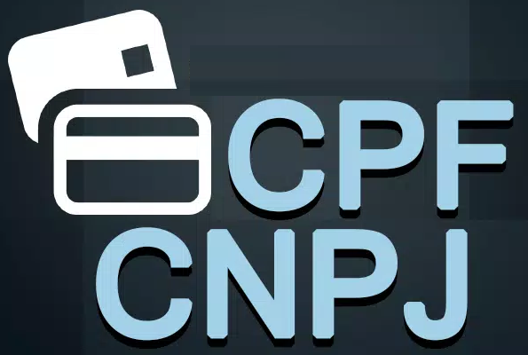

<p align="center">
    <a href="#cpf">
        
    </a>
</p>

# Cpf

[![][build-img]][build]
[![][nuget-img]][nuget]

Validação e formatação das documentações brasileiras de CPF e CNPJ.

[build]:     https://ci.appveyor.com/project/TallesL/net-Cpf
[build-img]: https://ci.appveyor.com/api/projects/status/github/tallesl/net-Cpf?svg=true
[nuget]:     https://www.nuget.org/packages/Cpf
[nuget-img]: https://badge.fury.io/nu/Cpf.svg
[CPF]:       http://en.wikipedia.org/wiki/Cadastro_de_Pessoas_F%C3%ADsicas

## Usage

```cs
using CpfCnpjLibrary;

Cpf.Validar("08597471077");    // True
Cpf.Validar("8597471077");     // True (0 à esquerda)
Cpf.Validar("716.603.990-68"); // True
Cpf.Validar("00000000000");    // False
Cpf.Validar("xpto");            // False

Cpf.FormatarComPontuacao("08597471077"); // "085.974.710-77"
Cpf.FormatarComPontuacao("085.974.710-77"); // "085.974.710-77"
Cpf.FormatarComPontuacao("xpto");         // "xpto"

Cpf.FormatarSemPontuacao("085.974.710-77"); // "08597471077"
Cpf.FormatarSemPontuacao("08597471077"); // "08597471077"
Cpf.FormatarSemPontuacao("xpto");         // "xpto"
```
